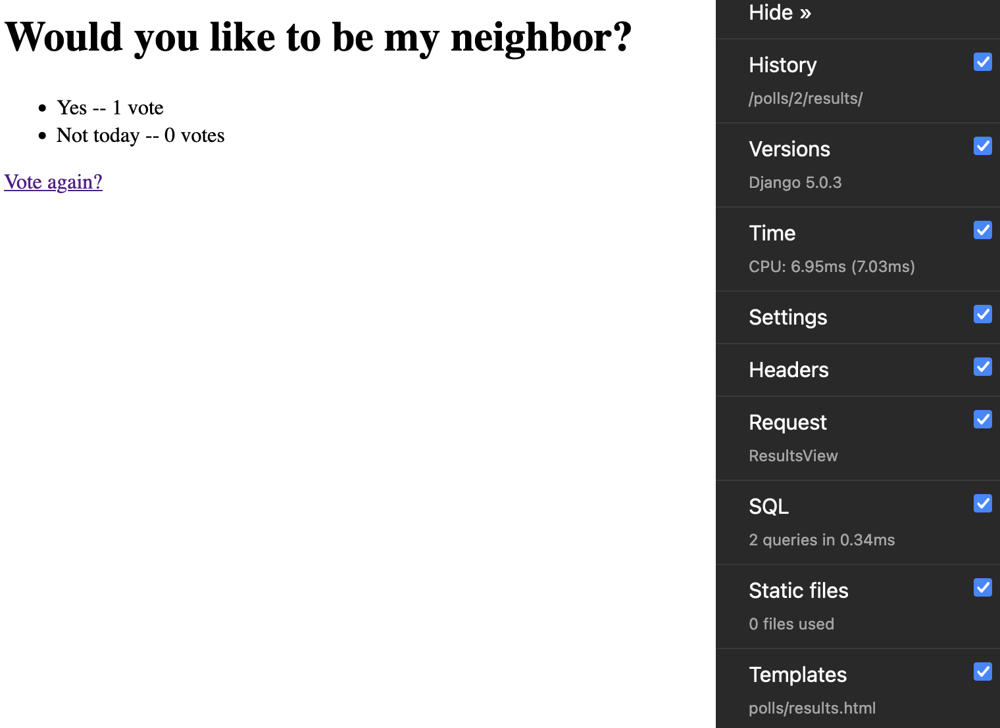

## Learning Django via DjangoProject
I am following this [tutorial](https://docs.djangoproject.com/en/5.0/intro) to learn Django and Python and apply my C# asp.net mvc knowledge

### Technologies used
* Python
* Django
* SQLite
* Django Debug toolbar
* VS Code
* Git

### Skills
* Create Models
* Connect to database and use migrations to update database
* Create Index, Detail, Vote and Results Views
* Map views to url
* Learn shorcuts (render, getobj_or404)
* Create Form, handle form data, display data
* Testing for business logic and client UI
* Static files: CSS stylesheet and background image
* Setup Admin interface, create user, customize view with display, filter and search options.
* Override template to customize admin look and feel
* Install 3rd party package: Debug toolbar
